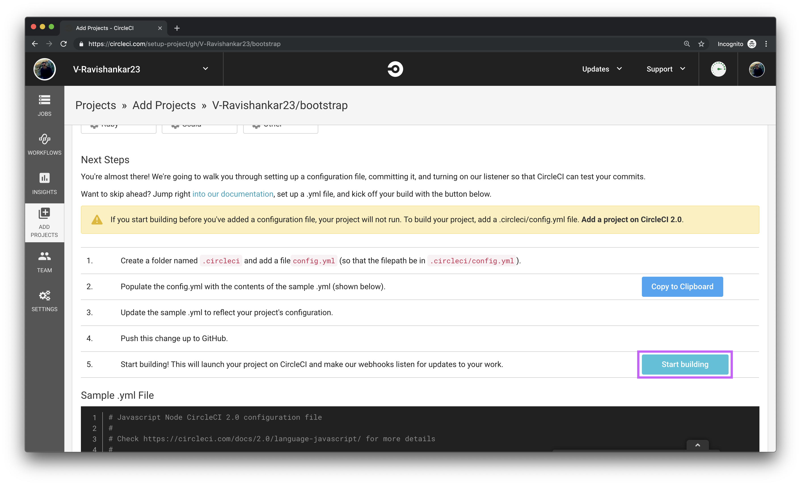

This document provides instructions and tips on how to set up a fork of an open source project on CircleCI:

* TOC
{:toc}

## Overview
If you are contributing to an open source project that builds on CircleCI, one of the best ways to check that your contributions will be successful is to run the tests for that project before you create a pull request. Because CircleCI configuration lives inside the project’s repository, you already have a copy of the CI config in your fork of the repository. All you need to do is [sign into CircleCI](https://circleci.com/vcs-authorize/), and set up your fork to start building. Don’t worry! CircleCI has a generous free plan for public repositories, so you’ll be able to build your fork for free.

## Sign in
Before you can build a project on CircleCI, you’ll need to [log in](https://circleci.com/vcs-authorize/) or [sign up](https://circleci.com/signup/).

If you belong to multiple organizations, make sure that you choose the correct one by selecting it from the dropdown menu in the upper left-hand corner of the CircleCI dashboard.

## Set up the for as a new project
To start building the project on CircleCI, click `Add Projects` on the left sidebar. From there, you can select the project that you’d like to set up by clicking the `Set Up Project` button on the right side. If you aren’t seeing your fork as a project in the list, make sure that you have the `Show Forks` checkbox selected. Repositories that are forks are indicated with a fork symbol to the right of the name.

The next page will give you a walkthrough on how to add a `config.yml` file to your project. Since you are building a fork of a project that already builds on CircleCI, the forked repository will already have a `config.yml` file which you can find in the `.circleci` directory. You don’t need to add a second config file, so you can just scroll down and click the `Start building` button.

And that’s it! You’ve started building the forked repository on CircleCI, and you are running the exact same CI jobs that the original repository uses.

## Troubleshooting
Build failed? There’s a few things that can cause this when you’re building a forked repository. Most of these can be solved by making some edits to the `.circleci/config.yml` file.

### Check for environment variables
If there are environment variables used in any of the jobs in the config file, you won’t be able to run those jobs successfully since you don’t have access to the required environment variables. Usually environment variables show up in deployment jobs, which is ok because you're not deploying anywhere, you just need to run the tests. In this case, just remove the deploy job from the config entirely, because you don’t need it (make sure you remove it from the declared `jobs` and from any workflows that the jobs shows up in.

It’s possible that environment variables show up in other places as well if the project uses other third party tools to run certain tests. If so, you’ll need to remove those jobs as well, or at least work around the steps that require the environment variables that you don’t have access to.

### Check for parallelism and resource classes
It’s possible that the open source project you forked uses more than our free open source plan. If so, they could be using premium features such as increased parallelism or different resource classes. To check for parallelism, see if there is anywhere in the config file that specifies a `parallelism` of greater than 4 (if your fork is public, you have access to 4 containers, so anything that is 4 or under shouldn’t be an issue). If there is any parallelism greater than 4, reduce the number to 4.

To check for resource classes, see if there is anywhere in the config where a `resource_class` is declared. On the free plan you won’t have access to resource classes, so you will need to remove that declaration fully. There are some open source projects that use powerful resource classes like GPU for complex jobs. In these cases, it is likely that you won’t be able to run the jobs without those resource classes. Unfortunately there is no way around this, so you won’t be able to run the CI jobs on your fork.

### Still running into issues?
Ask our community on https://discuss.circleci.com/.
